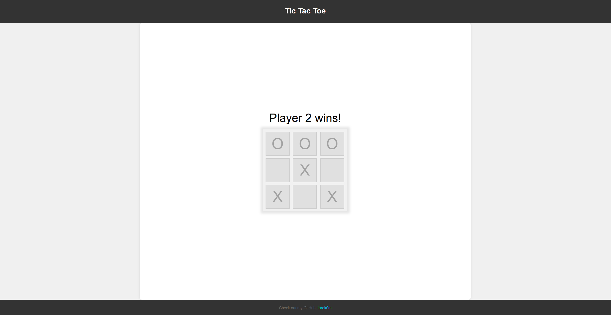

# Tic Tac Toe

This is a simple Tic Tac Toe game implemented in JavaScript as part of [The Odin Project](https://www.theodinproject.com/lessons/node-path-javascript-tic-tac-toe) assignment. The game is played using a graphical user interface (GUI) and is designed for two players.

## How to Play

1. Clone the repository to your local machine.
2. Open the `index.html` file in your browser.
3. Click on the cells in the game board to place your mark.

Or you can play the game live [here](https://tarek0m.github.io/odin-tic-tac-toe/).

## Instructions

- The game board is a 3x3 grid, and each cell is clickable.
- Player 1 uses 'X' and Player 2 uses 'O'.
- The game will automatically check for a winner after each move.

## Features

- Simple and intuitive GUI-based gameplay.
- Automatically checks for winning combinations.
- Displays the current state of the board after each move.

## Screenshot

## Author

- [tarek0m](https://github.com/tarek0m)

Enjoy playing Tic Tac Toe!
